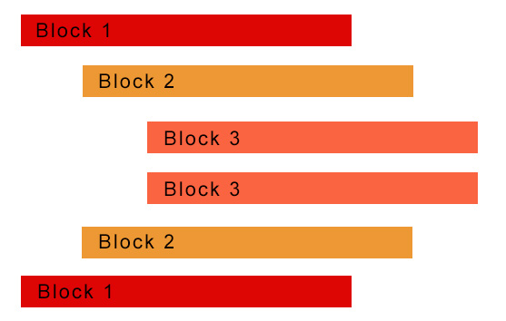

# Class 3


## Condition

- if

```shell script
python3 if.py
```

- if else

```shell script
python3 ifelse.py
```

- if else if

```shell script
python3 ifelseif.py
```

- combination

```shell script
python3 combine.py
```

## Block

A block of code is a grouped set of programming statements, starting with a colon and one level of indentation


