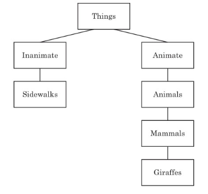
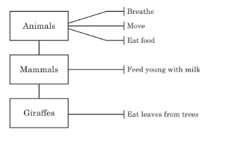

# Class 6

## Objects and Classes

The idea of objects is an important one in the world of computers.
Objects are a way of organizing code in a program and breaking things down to make it easier to think about complex ideas.

Object-oriented programming - [OOP](https://en.wikipedia.org/wiki/Object-oriented_programming)

In Python, objects are defined by classes, which we can think of as a way to classify objects into groups.
Here is a tree diagram  of the classes that giraffes and sidewalks would fit into based on our pre-ceding definitions.

The main class is Things. Below the Things class, we have Inanimate and Animate.
These are further broken down into just sidewalks for Inanimate, and Animals, Mammals, and Giraffes for Animate.

We can use classes to organize bits of Python code.
For example, consider the turtle module. All the things that Python’s turtle module can do—such as moving forward,
moving backward, turning left, and turning right—are functions in the Pen class.
An object can be thought of as a member of a class, and we can create any number of objects for a class—which we will get to shortly.

Let's create a new class.

```python
class Things:
    pass
```

The `pass` keyword is used when we want to provide a class or function but don’t want to fill in the details at the moment.

### Children and Parents

If a class is a part of another class, then it’s a child of that class, and the other class is its parent.
Classes can be both children of and parents to other classes. In our tree diagram, the class above another class is its parent, and the class below it is its child.
For example, Inanimate and Animate are both children of the class Things, meaning that Things is their parent.

```python
class Things:
    pass

class Inanimate(Things):
    pass

class Animate(Things):
    pass

class Sidewalks(Inanimate):
    pass

class Animals(Animate):
    pass
class Mammals(Animals):
    pass
class Giraffes(Mammals):
    pass
```

### Adding Objects to Classes

Create an object (instance) of a class.

```python
reginald = Giraffes()
```

This code tells Python to create an object in the Giraffes class and assign it to the variable reginald.
Like a function, the class name is followed by parentheses.

### Defining functions of a class

Remember how to defina a function in Python?

```python
def myfunc(firstname, lastname):
    print('hello "%s %s", how are you?' % (firstname, lastname))
```

Here is how to define functions in a class

```python
class ThisIsMySillyClass:
    def this_is_a_class_function():
        print('I am a class function')
    def this_is_also_a_class_function():
        print('I am also a class function. See?')
```

Functions in a class are the characteristics that an object of this class has.



These characteristics can be thought of as actions, or functions—things that an object of that class can do. 

```python
class Animals(Animate):
    def breathe(self):
        print('breathe')
    def move(self):
        print('move')
    def eat_food(self):
        print('eat food')

class Mammals(Animals):
    def feed_young_with_milk(self):
        print('feed young with milk')
class Giraffes(Mammals):
    def eat_leaves_from_trees(self):
        print('eating leaves')
```

### Inheritance
Objects of children class can use the function not only defined in its own class, but also in parent classes.


```python
reginald = Giraffes()
reginald.move()
reginald.eat_leaves_from_trees()
```

### Initializing an object

When creating an object, sometimes we want to initialize the object with some values.
To do this, we create an **\_\_init\_\_** function, we call this special function as `Constructor` in [OOP](https://en.wikipedia.org/wiki/Object-oriented_programming)

```python
reginald = Giraffes("Jason")
reginald.move()
reginald.eat_leaves_from_trees()
```


### Why using classes and objects

```text
>>> reginald = Giraffes()
>>> harold = Giraffes()
>>> reginald.move()
moving
>>> harold.eat_leaves_from_trees()
eating leaves
```

Object is an instance created for a class. Each object keep its own scope of functions and properties.
In the example above,  one giraffe, reginald would be walking, and the other, harold, would be eating.

Run this [giraffes.py](giraffes.py) as an example.

### Exercise

1. Create at least 3 levels of class and sub classes. Define 2 or more properties and functions in each level
    - Draw diagram on paper with these classes and their properties and functions
    - Write a python program with the design above, create one or more object instance from the classes and call the there functions

2. Design a python class called `Converter`. It must have the following features:
    - convert temerature between `Celsius` to `Fahrenheit` using the formular: Celsius x 1.8 + 32 = Fahrenheit
    - convert length unit between `inch` and `centimeter` using the formular: inch x 2.54 = cm
    - Ask user to input lengh or temerature and convert the user input and print the result in console

## Module

Modules are used to group functions, variables, and other things together into larger, more powerful programs.
Some modules are built in to Python, and you can download other modules separately.

You’ll find modules to help you write games (such as tkinter , which is built in, and PyGame , which is not),

### Use module

Example 1

```python
import time
print(time.asctime())
```

Example 2

```python
import random
print(random.randint(1, 100))
58
```

```shell script
python module.py
```
