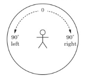
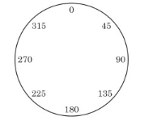

# Basic of turtle graphics

The [star.py](star.py) is an example of how the `turtle` module can do.

## Start from something simple

- Import the `turtle` module

```text
>>> import turtle
```

- Create a canvas

```text
>>> t = turtle.Pen()
```

- Move the turtle

```text
>>> t.forward(50)
```

Turtle has moved forward `50` pixels. A pixel is a single point on the screen—the smallest element that can be represented.

```text
>>> t.backward(100)
``` 

- Turn the turtle

```text
>>> t.left(90)
>>> t.forward(50)
>>> t.left(90)
>>> t.forward(50)
>>> t.left(90)
```




- Stop drawing

```text
>>> t.up()
>>> ...
>>> t.down()
```

The `up()` function raise the pen and stop drawing.
The `down()` function put the pen back down and start drawing.

- Reset and clear

```text
>>> t.reset()
```
This erases the canvas and puts the turtle back at its starting position.

```text
>>> t.clear()
```
This just clears the screen and leaves the turtle where it is.


### Exercise

- Draw a square with 100 x 100 pixels dimension.